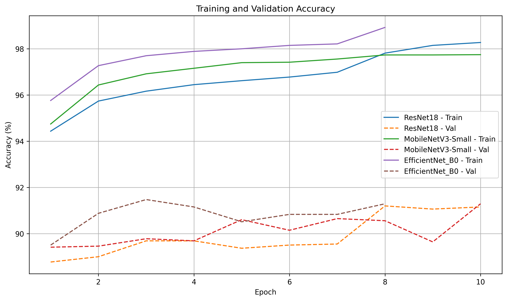
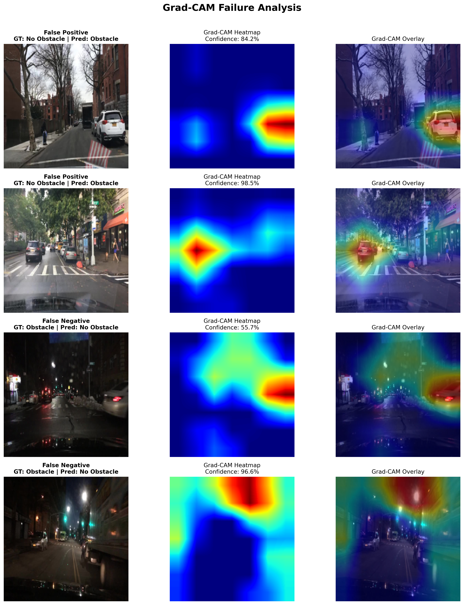

# Autonomous Driving Binary Classification

This repository implements a binary image-classification pipeline for autonomous driving scenes, with the objective of distinguishing between:

- No Obstacle
- Obstacle

The project uses road-scene imagery derived from BDD100K and focuses on a realistic research-engineering workflow: dataset construction, iterative model-guided refinement, model comparison, error analysis, and Grad-CAM-based interpretability.

## Key results

- Final dataset size: 76,210 images
- Training split: 74,028 images
- Validation split: 2,182 images
- Selected architecture: EfficientNet-B0
- Best validation accuracy: 91.475710%
- Best validation F1: 0.929758

## Problem statement

The task is to classify images from autonomous-driving scenes as either containing an obstacle or not. This is formulated as a binary computer-vision classification problem using transfer learning on pretrained CNN backbones.

A central part of the project is not only model training, but also dataset development. The dataset was not treated as a static artifact; instead, it was built and refined iteratively based on model failures, validation behavior, and visual inspection.

## Dataset

### Source and labeling

The project is built from BDD100K imagery. The original BDD100K annotations were used to derive the binary obstacle/no-obstacle labels relevant to this task. This means the classification labels are derived labels rather than direct raw dataset labels from the original source distribution.

The repository does not contain the original BDD100K dataset, and the project operates on CSV-based metadata plus image paths to the source imagery.

### Dataset preparation methodology

The initial dataset was constructed from BDD100K using the provided labels to separate the relevant obstacle and no-obstacle examples. The initial training set contained approximately 4,000 images and the initial validation set approximately 2,200 images.

Rather than training immediately on the full dataset, the workflow followed an iterative model-guided refinement process:

1. Train on an initial subset or chunk of data.
2. Evaluate validation behavior and inference predictions.
3. Examine failure cases and misclassifications.
4. Use Grad-CAM to inspect the image regions driving a prediction.
5. Identify ambiguous or problematic samples.
6. Manually review and reorganize data where necessary.
7. Expand or refine the dataset based on the observed failure modes.
8. Retrain and repeat the cycle.

This iterative process is an important part of the project and reflects a practical model-driven dataset refinement workflow rather than a one-shot label assignment.

### Final dataset composition

The final dataset used for model evaluation contains:

| Split | Total Images | No Obstacle | Obstacle |
|---|---:|---:|---:|
| Total | 76,210 | 38,961 | 37,249 |
| Train | 74,028 | 37,637 | 36,391 |
| Validation | 2,182 | 1,324 | 858 |

The training split references the original BDD100K image storage, while the validation images are maintained separately as a curated validation set.

### Dataset and repository note

The repository intentionally excludes the original BDD100K image archive and large trained checkpoints. The `.gitignore` excludes directories such as `data/`, `saved_models/`, `logs/`, and checkpoint files like `*.pt` and `*.pth`, which reflects the fact that the source dataset and model artifacts are expected to exist outside the repository snapshot.

## Exploratory analysis and project notebooks

The repository includes a set of notebooks for structured investigation:

- `notebooks/01-dataset-overview.ipynb`
- `notebooks/02-training-models.ipynb`
- `notebooks/03-model-comparison.ipynb`
- `notebooks/04-inference.ipynb`
- `notebooks/05-gradcam-analysis.ipynb`

These notebooks support exploratory data analysis, training iteration, model comparison, inference review, and Grad-CAM interpretability.

## Methodology and pipeline

The project uses PyTorch-based transfer learning with ImageNet-pretrained backbones.

### Core implementation

The core training and inference flow is implemented in:

- `main.py`
- `src/config.py`
- `src/dataset.py`
- `src/model.py`
- `src/train.py`
- `src/inference.py`
- `src/gradcam.py`

### Model configuration

The configuration file `config/config.json` defines the run-level parameters.

The training pipeline uses binary classification with a single output logit and `BCEWithLogitsLoss`, consistent with the one-class binary formulation.

### Model architectures evaluated

Three transfer-learning CNN architectures were trained and compared:

- EfficientNet-B0
- MobileNetV3-Small
- ResNet18

`src/model.py` builds these architectures using torchvision pretrained weights and custom classification heads. The model factory supports:

- `resnet18`
- `mobilenet_v3`
- `efficientnet_b0`

The classifier head is a lightweight fully connected block with dropout and ReLU layers on top of the frozen or partially frozen backbone.

## Training

Training is configured through the repository entry point:

```bash
python main.py --config="config/config.json"
```

The project is designed as a configuration-driven experimentation workflow. The training routine includes:

- reproducible random seeding
- `AdamW` optimization
- `ReduceLROnPlateau` scheduler
- gradient accumulation
- validation metrics logging
- confusion matrix logging
- checkpoint creation

The training code and metrics are in `src/train.py`. Additional hyperparameter search support is implemented in `src/tuning.py` using Optuna, with the search space defined in `config/search_space.py`.

## Model comparison

The following validation results were obtained on the final dataset:

| Model | Val Accuracy | Val Precision | Val Recall | Val F1 | Val Loss | Best Epoch | Total Parameters | Trainable Parameters | Model Size |
|---|---:|---:|---:|---:|---:|---:|---:|---:|---:|
| EfficientNet-B0 | 91.475710% | 0.929758 | 0.929758 | 0.929758 | 0.385909 | 3 | 4.335741M | 4.335741M | 16.539539 MB |
| MobileNetV3-Small | 91.292392% | 0.924401 | 0.932779 | 0.928571 | 0.396626 | 10 | 1.074977M | 1.074977M | 4.100712 MB |
| ResNet18 | 91.200733% | 0.921131 | 0.935045 | 0.928036 | 0.376390 | 8 | 11.308097M | 11.308097M | 43.136967 MB |

These results are the actual validation metrics from the final comparison workflow.

## Final model selection

EfficientNet-B0 was selected as the final model for this project.

The selection was based on the overall balance of:

- highest validation accuracy: 91.475710%
- highest F1 score: 0.929758
- 4.335741M parameters
- model size: 16.539539 MB
- strong overall performance-to-complexity trade-off

This is not a claim that EfficientNet-B0 is universally superior to every alternative architecture. Rather, in this project and on this validation set, it offers the strongest overall trade-off between predictive performance and model complexity.

Key trade-offs:

- MobileNetV3-Small is substantially smaller and still competitive.
- ResNet18 achieves slightly higher recall.
- EfficientNet-B0 produces the strongest overall balance of accuracy, F1, and model footprint for this project.

## Grad-CAM

The repository includes a Grad-CAM implementation in `src/gradcam.py` and an explicit interpretability notebook in `notebooks/05-gradcam-analysis.ipynb`. Grad-CAM is used to investigate false positives and false negatives to understand whether the model is relying on relevant road-scene context or on spurious visual patterns.

## Visual summaries

The repository contains several useful diagnostic plots. A small subset of the most informative visuals is included below. More detailed analysis is available in the notebooks and the `graphs/` directory.

### Model comparison



### Grad-CAM failure analysis



Additional analysis plots available in the repository include:

- `graphs/dataset_distribution.png`
- `graphs/model_loss_comparison.png`
- `graphs/model_complexity_comparison.png`
- `graphs/prediction_prob_distribution.png`
- `graphs/pred_confidence.png`

## Repository structure

```text
.
├── .gitignore
├── README.md
├── config
│   ├── config.json
│   └── search_space.py
├── graphs
│   ├── best_val_acc_comparison.png
│   ├── dataset_distribution.png
│   ├── gradcam_failure_analysis.png
│   ├── model_acc_comparison.png
│   ├── model_complexity_comparison.png
│   ├── model_loss_comparison.png
│   ├── pred_confidence.png
│   ├── prediction_prob_distribution.png
│   ├── sample_images_no_obstacle.png
│   └── sample_images_obstacle.png
├── main.py
├── notebooks
│   ├── 01-dataset-overview.ipynb
│   ├── 02-training-models.ipynb
│   ├── 03-model-comparison.ipynb
│   ├── 04-inference.ipynb
│   └── 05-gradcam-analysis.ipynb
├── requirements.txt
└── src
    ├── __init__.py
    ├── config.py
    ├── dataset.py
    ├── gradcam.py
    ├── inference.py
    ├── model.py
    ├── train.py
    ├── tuning.py
    └── utils
        └── path_utils.py
```

### Key components

- `main.py`: CLI entry point for running the training pipeline.
- `src/dataset.py`: image loading, transforms, dataset classes, and preprocessing logic.
- `src/model.py`: pretrained backbone selection and classifier wrapper.
- `src/train.py`: training loop, validation loop, metric logging, confusion matrix output, and checkpoint creation.
- `src/inference.py`: batch and single-image inference utilities.
- `src/gradcam.py`: Grad-CAM implementation and heatmap overlay generation.
- `src/tuning.py`: Optuna-based hyperparameter search scaffolding.
- `config/config.json`: model and training configuration.
- `notebooks/`: analysis and experimentation notebooks.
- `graphs/`: generated plots and model diagnostics.

## Installation

Install the repository dependencies with:

```bash
pip install -r requirements.txt
```

The project dependencies include:

- PyTorch
- torchvision
- pandas
- numpy
- scikit-learn
- tqdm
- tensorboard
- torchinfo
- albumentations

## Usage

To run the default training configuration:

```bash
python main.py --config="config/config.json"
```

The configuration file is the central point for model and training settings. The scripts are designed around a reproducible training workflow that produces checkpoints and experiment artifacts according to the configured paths.

## Limitations and considerations

- The repository does not contain the raw BDD100K archive.
- Model checkpoints are not included in the repository snapshot.
- Final dataset construction depended on iterative manual review and refinement informed by model errors and Grad-CAM analysis.
- The final model is selected based on validation metrics rather than a separate unseen holdout set.
- Training paths and CSV metadata must be configured externally to match the local dataset layout.

## Future improvements

Potential follow-ups for this project include:

- automating parts of the dataset refinement loop for repeated error-driven curation
- expanding the evaluation beyond validation accuracy to more detailed per-class analysis
- testing additional architectures and calibration-aware metrics
- investigating failure cases across more difficult driving scenarios and occlusion patterns
- integrating stronger uncertainty estimation for borderline predictions

## Summary

This repository reflects a realistic ML engineering workflow for a binary autonomous-driving classification problem: derive a task-specific dataset from BDD100K, iterate through training and failure analysis, refine the data based on observed model weaknesses, compare multiple transfer-learning backbones, and select the best-performing model using evidence from validation metrics and interpretability analysis.

The final model, EfficientNet-B0, offers the strongest overall validation performance and complexity trade-off for this project while remaining consistent with the broader error-analysis and dataset-development workflow that shaped the final dataset.
